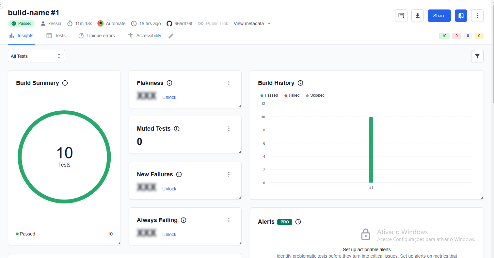

# PGATS - Entrega de trabalho - CI

## Pré-requisitos

1. Instale o [git](https://git-scm.com)
2. Instale o [nodejs](https://nodejs.org/)
3. Instale o Yarn - `npm install -g yarn`
4. Instale as dependências
   ```bash
   cd PGATS-TrabalhoFinal-Web-Cypress
   yarn
   ```
5. Execute os testes end-to-end com o Cypress
    ```bash
    yarn test
    ```
6. Este projeto possui um script chamado `report` no `package.json`. Verifique o caminho correto antes de rodar.
7. Para execução do relatório, rode o comando
    ```bash
    yarn report
    ```
Evidência:


---

## Resultado dos testes - BrowserStack


---